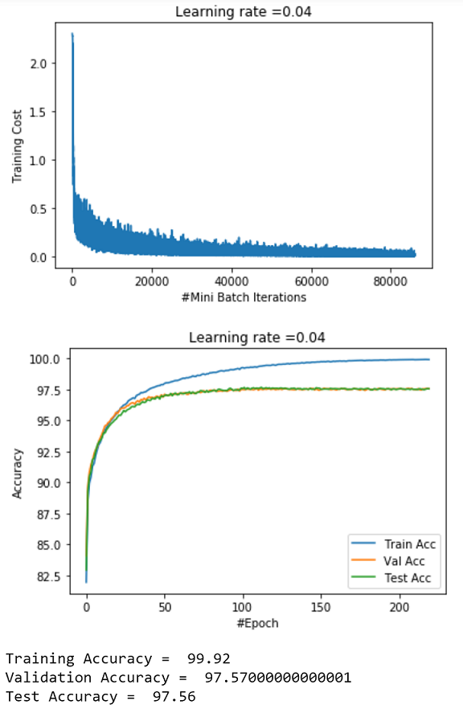
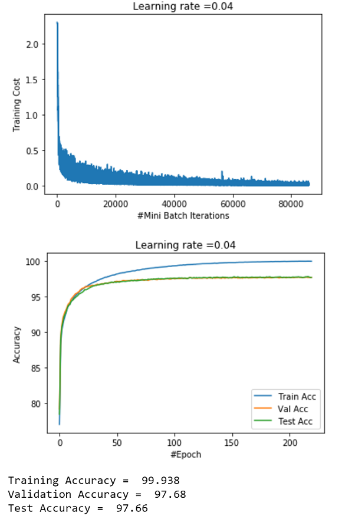

# Deep_Learning_Challenge

## Folder Structure
**code/data/**: This directory contains Training Dataset and Test Dataset Files

**code/results/**: This directory contains snapshots "Oil_Spill_Model.png" and "Oil_Spill_Model_Extra_Credit.png" showing the plots of training, validation 
and test accuracies and their corresponding values.

**code/Oil_Spill_Model.ipynb, code/Oil_Spill_Model.py**: Implementation of basic Deep Neural Network

**code/Oil_Spill_Model_Extra_Credit.ipynb, code/Oil_Spill_Model_Extra_Credit.py**: Implementation of mean-only batch normalized Deep Neural Network

## Running the Code
There are 2 python scripts i.e. Oil_Spill_Model.py and Oil_Spill_Model_Extra_Credit.py which contains the standard Deep Neural Network
and mean-only batch normalized Neural Network. In order to run the files just open the console and run the below commands:

	python Oil_Spill_Model.py

	python Oil_Spill_Model_Extra_Credit.py

## Brief Explanation of the Implemented Models
There are 2 Jupyter Python Notebooks the details of which are mentioned below:

### Oil_Spill_Model.ipynb

This python notebook has a general implementation of multi layer neural network using NumPy.

#### Functionality Implemented: 

a) Variable No. of Hidden layers/Hidden units per layer:

The number of hidden layers and hidden units in each layer are controlled by the parameter "layers_dims".
Currently layers_dims is set to [784,64,10].
The implemented code provides support to accommodate any number of hidden layers.
If you would like to insert more hidden layers or change hidden units, then just update the value of this variable.

b) Support for various Activation Functions:

The variable "sigm" controls the activation function to be used for hidden layers. Currently, sigmoid(x), 
1.7159*tanh(2x/3) and Relu activation functions are present. 

	Set sigm = 0 for Sigmoid,

	sigm = 1 for Tanh,
	
	sigm = 2 for Relu.
	
The output layer is a softmax activation layer.
	
c) Support for Momentum Weight Update:

There is support for Momentum Weight update present in the code. The variable "momentum" can be set to 1 to use 
gradient descent with momentum.

**Detailed List of Functions Implemented**: 

	1. one_hot_encoding -> Does One hot encoding of output labels 
	
	2. init_weights -> Random Weight Initialization of each layer
	
	3. relu         -> Computing Relu Activation for a hidden layer
	
	4. sigmoid      -> Computing Sigmoid(s)/Tanh(x) Activation for a hidden layer
	
	5. softmax      -> Computing Softmax Activation for a Output layer
	
	6. linear_prop_forward   -> Implementation of Linear Forward Propagation of the NN
	
	7. compute_cost          -> Cross Entropy Cost Computation 
	
	8. relu_derivative       -> Relu Derivative Computation for Back Propagation
	
	9. sigmoid_derivative    -> Sigmoid Derivative Computation for Back Propagation
	
	10. grad_calculation     -> Gradient Calculation for hidden layer parameters
	
	11. linear_prop_backward -> Implementation of Linear Backward Propagation thereby computing gradients
	
	12. update_params   -> Updating hidden layer parameters
	
	13. predict         -> Accuracy Prediction for Given Image Vector
	
	14. get_mb          -> Generating Mini Batches for a given mini-batch size
	
	15. momentum_v_init -> Initialization of Momentum Parameter "v"
	
	16. momentum_update -> Weight Update using Momentum
	
	17. multi_layer_model -> Trains Deep NN on training set and returns the parameters learned
	
	18. oil_spill_model   -> Reads the Dataset, does basic preprocessing and then runs the multi_layer_model
	

	
	
###	Oil_Spill_Model_Extra_Credit.ipynb
This python notebook is very much similar to the above with mostly same functions implemented in it. 
In order to compute mean only batch normalization, I have implemented additional layer 784 after input layer 
which computes the mean normalization. I have updated the existing functions to init_weights_2, linear_prop_forward_2,
linear_prop_backward_2, update_params_2 and predict_2.

## RESULTS:

The training set is normalized by dividing it by 255 so that all the pixel values are between 0 and 1.
The original training set is split to get 50,000 training examples and 10,000 validation examples in order to 
check the performance of the training model on the validation set. 

For the assignment, I have used 64 Relu Hidden layer units and 10 Softmax output units because of 10 class labels and learning rate = 0.04.
While training over 50k training examples, I am using a mini-batch size of 128 and the batch size can be changed by changing 
the "mini_batch_size" parameter. 

Without Mean Only Batch Normalization, I got

	Training Accuracy = 99.92
	
	Validation Accuracy = 97.57
	
	Test Accuracy = 97.56
	
	
With Mean Only Batch Normalization, I got

	Training Accuracy = 99.938
	
	Validation Accuracy = 97.68
	
	Test Accuracy = 97.66
	

	
From the Plots of training accuracy, validation accuracy and test accuracy, it is clear that with mean-only batch normalization, 
the neural network attains 95% accuracy mark in relatively fewer iterations compared to standard model without mean batch normalization.
Thus Mean Batch Normalization helps in speeding up the learning of the Neural Network along with giving better performance on the test
data compared to the standard model.